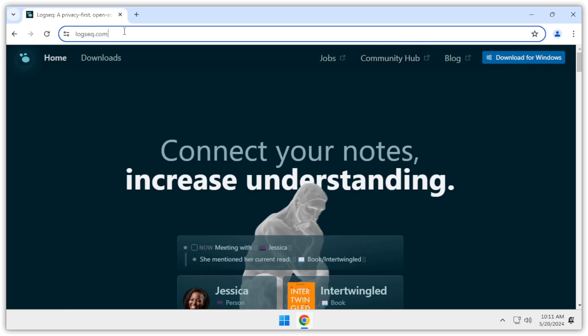
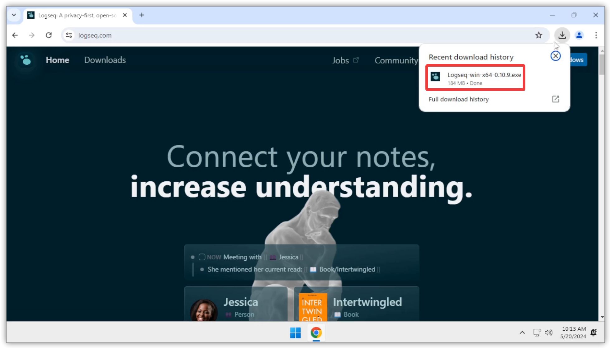
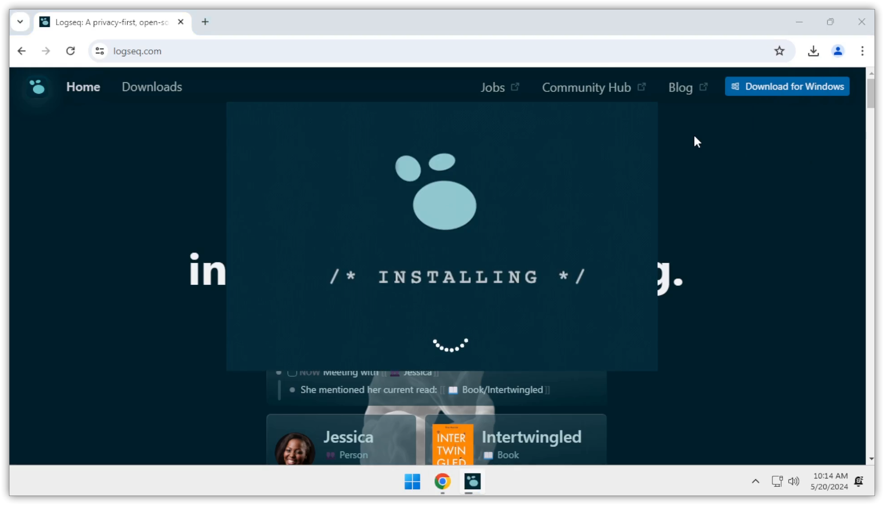
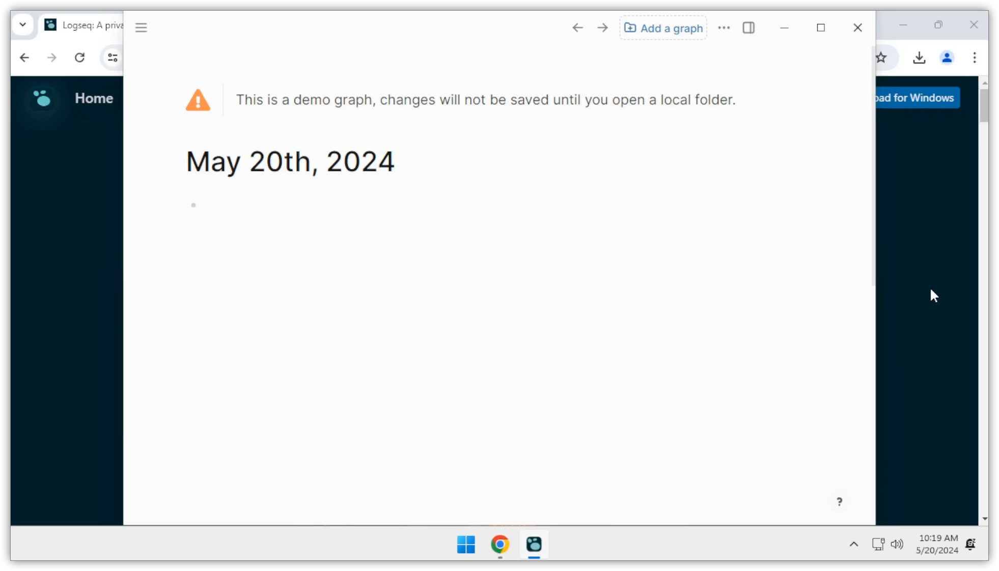

# Guía de Instalación de Logseq
- ## Introducción
  
  Esta guía proporciona instrucciones paso a paso para instalar Logseq en tu sistema.
- ## Requisitos Previos
  - Un sistema operativo compatible (Windows, macOS, Linux)
  - Conexión a Internet
- ## Pasos de Instalación
- ### Descargar el Instalador
  - Visita la [página de descargas de Logseq](https://logseq.com/#/page/download) y selecciona la versión correspondiente a tu sistema operativo.
    - 
- ### Ejecutar el Instalador
  - Una vez descargado el archivo, haz doble clic en él para iniciar el proceso de instalación.
    - {:height 419, :width 718}
    - 
- ### Seguir las Instrucciones en Pantalla
  - Sigue las instrucciones que aparecen en la pantalla para completar la instalación.
    - 
      id:: 664b5ca8-0cfc-4945-be41-d01ad90567b6
- ### Iniciar Logseq
  - Después de la instalación, inicia Logseq desde el menú de aplicaciones o desde el acceso directo en el escritorio.
    - 
- ## Conclusión
  
  ¡Felicidades! Has instalado Logseq correctamente. Ahora puedes empezar a utilizarlo para gestionar tus notas y proyectos.